# Smart Routing Diagram

This diagram covers the smart-routing flow used by the chat path in:

- `server/routes/chat.py`
- `orchestrator/core.py`
- `orchestrator/smart_router.py`
- `orchestrator/tier_decider.py`
- `orchestrator/model_selector.py`
- `orchestrator/response_validator.py`
- `orchestrator/fallback_manager.py`

It includes the route-level entry decision, the smart-router planning phase, and the runtime retry/escalation loop.

```mermaid
flowchart TD
    A["Incoming /v1/chat request"] --> B{"Manual provider/model supplied?"}
    B -- Yes --> B1["Use explicit model<br/>routing_mode=legacy"]
    B1 --> Z["Direct provider invocation<br/>smart router bypassed"]

    B -- No --> C{"smart_mode enabled and<br/>ENABLE_TRUE_SMART_CHAT_ROUTING=true?"}
    C -- No --> C1["Legacy auto picker<br/>_pick_smart_provider()"]
    C1 --> Z

    C -- Yes --> D["Build routing constraints<br/>cost, latency, context, preferred provider, allowlist"]
    D --> E["Preview first smart candidate<br/>for stream start metadata"]
    D --> F["CortexOrchestrator.ask()<br/>routing_mode = smart / cheap / strong"]

    F --> G["Optimize prompt and build messages"]
    G --> H{"Research mode enabled<br/>and service configured?"}
    H -- Yes --> H1["Enrich messages with web research"]
    H -- No --> I["PromptAnalyzer.analyze(prompt, context)"]
    H1 --> I

    I --> J["Apply constraint-driven feature overrides<br/>strict_format / json_only"]
    J --> K{"Forced tier?"}
    K -- cheap --> K1["T0"]
    K -- strong --> K2["T2"]
    K -- smart --> L["TierDecider.decide(features)"]

    L --> M["Choose initial tier"]
    K1 --> M
    K2 --> M

    M --> N["ModelRegistry.get_candidates(tier, constraints)"]
    N --> O["ModelSelector.select()"]
    O --> P["Rank candidates by reliability, coding preference,<br/>tag fit, blended cost, provider preference, context"]
    P --> Q["Ordered candidates<br/>primary + fallbacks"]
    Q --> R["Start attempt loop"]

    R --> S{"Candidates left<br/>in current tier?"}
    S -- No --> S1{"Higher tier available?"}
    S1 -- Yes --> S2["Escalate tier and reselect candidates"]
    S2 --> N
    S1 -- No --> Y["Return best non-error response<br/>or last response"]

    S -- Yes --> T["Pop next candidate"]
    T --> U{"Circuit breaker open?"}
    U -- Yes --> U1["Synthesize provider_error response"]
    U -- No --> V["Invoke provider client"]

    U1 --> W["ResponseValidator.validate()"]
    V --> W
    W --> X{"Response valid?"}
    X -- Yes --> X1["Attach routing metadata<br/>and return final response"]
    X -- No --> AA["FallbackManager.decide()"]

    AA --> AB{"Retry same tier?"}
    AB -- Yes --> R
    AB -- No --> AC{"Escalate tier?"}
    AC -- Yes --> AD["Mark fallback_used and move to next tier"]
    AD --> N
    AC -- No --> Y

    Y --> X1

    subgraph TierRules["TierDecider highlights"]
        T3A["T3 for code/logs, advanced reasoning,<br/>strict high-accuracy, or ultra-strict factual prompts"]
        T2A["T2 for math, analysis, strict format,<br/>large context, or high-accuracy factual prompts"]
        T0A["T0 for short simple rewrite, summarize,<br/>bullets, or brainstorm prompts"]
        T1A["T1 default"]
    end

    L -. uses .-> TierRules

    subgraph ValidatorRules["ResponseValidator highlights"]
        V1["Reject provider_error, timeout, and rate_limit"]
        V2["Reject refusals"]
        V3["Reject invalid JSON when json_only=true"]
        V4["Reject truncated complex or strict outputs"]
        V5["Reject too-short responses"]
    end

    W -. checks .-> ValidatorRules

    subgraph FallbackRules["FallbackManager highlights"]
        F1["Retry same tier on provider_error, rate_limit,<br/>timeout, or refusal when fallbacks remain"]
        F2["Escalate tier on refusal when same-tier fallbacks are exhausted"]
        F3["Escalate tier on too_short, format_violation, or truncated"]
        F4["Stop on max attempts or latency budget"]
    end

    AA -. applies .-> FallbackRules
```

Notes:

- `cheap` forces tier `T0`; `strong` forces tier `T2`; `smart` delegates tier selection to `TierDecider`.
- The preview step is used by streaming routes so the client can emit a stable `start` event before the full response is generated.
- If no valid response passes the validator, the orchestrator still returns the best available non-error response before falling back to the last error response.
