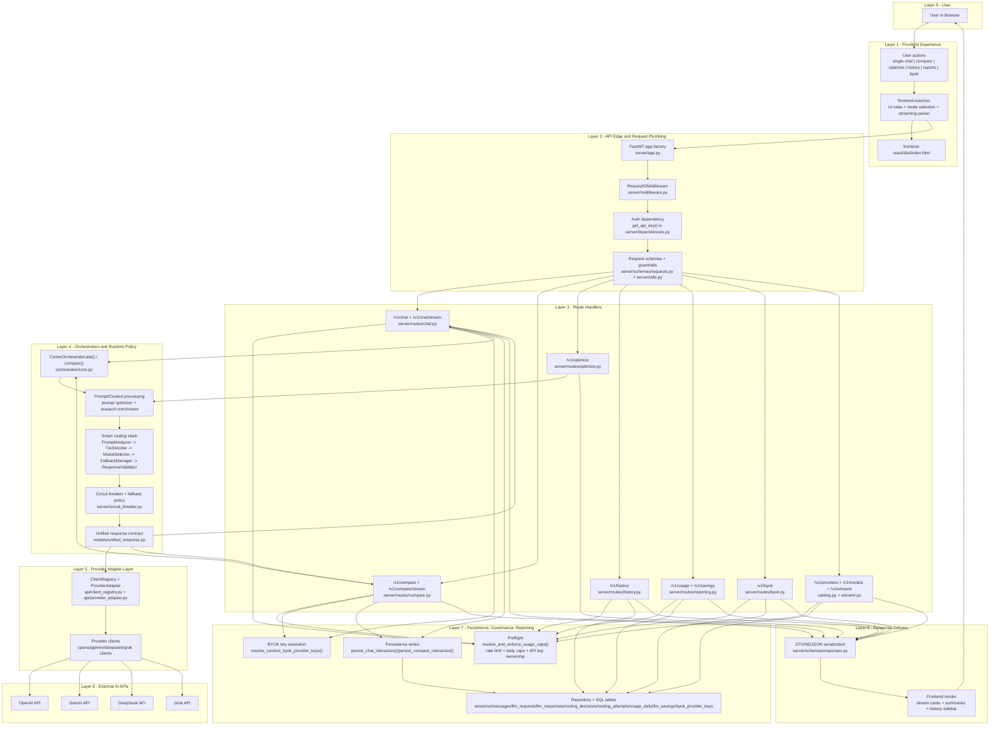
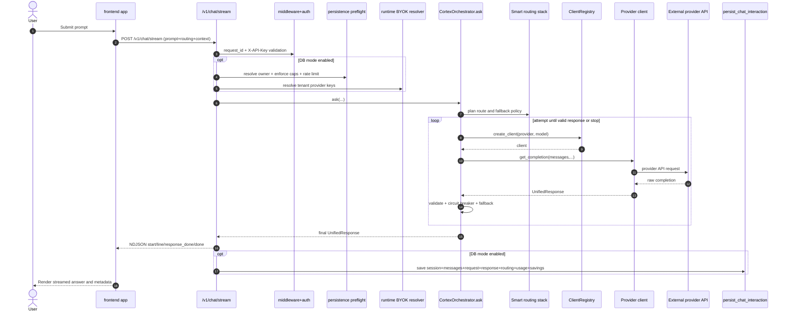
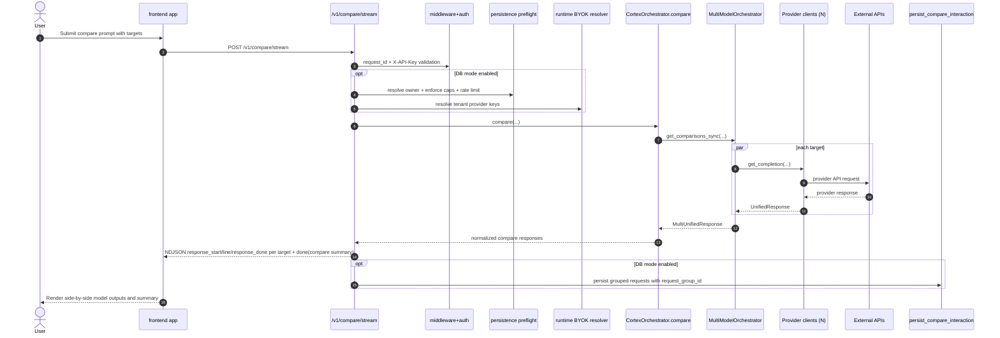
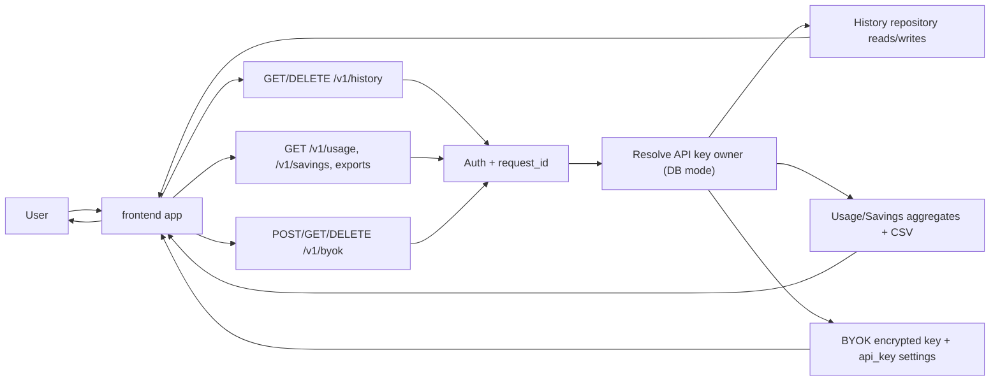

# CortexAI User Flow Diagram Source

This file is a diagram-ready source of truth for user-facing runtime flows across all layers.

## Render Options

1. Mermaid Live Editor
- Open https://mermaid.live
- Paste any `mermaid` block from this document.
- Export as SVG or PNG.

2. Mermaid CLI
- Save a diagram block into a `.mmd` file.
- Run:
```bash
npx -y @mermaid-js/mermaid-cli -i <diagram>.mmd -o <diagram>.svg
```

## Layered End-to-End Flow (User Perspective)



## User Journey: Single Chat (Streaming)



## User Journey: Compare (Streaming, Multi-Target)



## User Journey: History, Reporting, BYOK



## Layer-to-Code Map

- Layer 1 (Frontend): React `frontend-react/src/` + built `frontend-react/dist/index.html`
- Layer 2 (Edge/Middleware/Auth): `server/app.py`, `server/middleware.py`, `server/dependencies.py`
- Layer 3 (Routes): `server/routes/*.py`
- Layer 4 (Orchestration): `orchestrator/core.py`, `orchestrator/smart_router.py`, `orchestrator/*`
- Layer 5 (Adapters): `api/client_registry.py`, `api/provider_adapter.py`, `api/*_client.py`
- Layer 6 (External APIs): OpenAI, Gemini, DeepSeek, Grok
- Layer 7 (Persistence/Governance): `server/persistence.py`, `db/repository.py`, `server/rate_limit.py`, `server/privacy.py`, `server/savings.py`
- Layer 8 (Response Contracts): `server/schemas/responses.py`, frontend stream/event rendering in `frontend-react/src/api/` + `frontend-react/src/hooks/`

